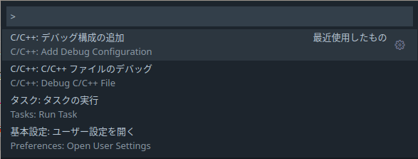

# qulacs_debug

qulacs でデバッグしたい時に試している方法

## ディレクトリ構造

devcontainerを利用している前提。

```
pwd
```
```
/workspaces/qulacs-osaka
```

デバッグしたいプログラム `main.cpp` を置くフォルダとして `qulacs_debug` を作る。
その中に、ビルドするための `Makefile` を置く。

この `Makefile` は以下のコマンドを実行するものと同じ役割です。

```bash
g++ main.cpp -O2 -g -fopenmp --coverage -I/workspaces/qulacs-osaka/include -L/workspaces/qulacs-osaka/lib -lcppsim_static -lcsim_static -lvqcsim_static -o main
```

`.vscode` フォルダに、VSCodeで gdb を起動するための設定ファイル `launch.json` を作成する。
ここでは、コマンドパレットから `>C/C++: Add Debug Configuration`、`(gdb) 起動`で生成出来るものを利用する。




生成出来た `launch.json` の `program` を適切に変更する。
例えば、`${fileDirname}/${fileBasenameNoExtension}` とすれば、`/workspaces/qulacs_debug/main.cpp` を対象にした場合は `/workspaces/qulacs_debug/main` のバイナリを指定できる。

```diff
- "program": "プログラム名を入力してください (例: ${workspaceFolder}/a.out)",
+ "program": "${fileDirname}/${fileBasenameNoExtension}",
```

この時、以下のようなディレクトリ構成になる。

```
/workspaces/qulacs-osaka/
├── .vscode
│  ├── launch.json
│  └── tasks.json
├── benchmark
├── bin
├── build
...
├── qulacs_debug
│  ├── main.cpp
│  └── Makefile
├── script
...
```

## VSCode で gdb debug

まずはプログラムをデバッグオプション(`-g`)付きでビルドする。

```
cd /workspaces/qulacs-osaka/qulacs_debug
make main
```

`/workspaces/qulacs_debug/main.cpp` を開き、ブレークポイントを設定し、VSCode上で `F5`キーを押す。
もしくは、左側のアクティビティバーから `実行とデバッグ`、から`(gdb) 起動`を選択した状態で `|>` ボタンから デバッグを開始する。


